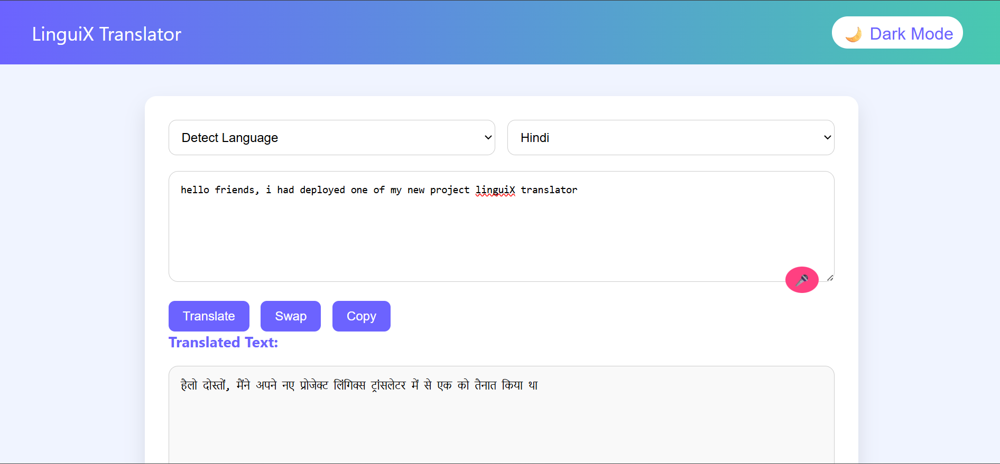
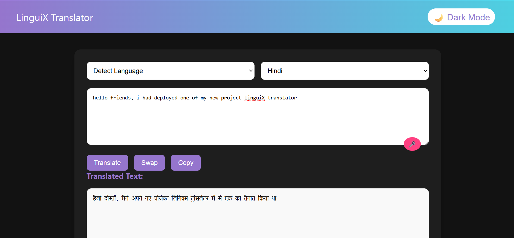

# 🌍 LinguiX Translator

A voice-enabled, real-time language translation web app powered by **Node.js**, **Express**, and the **Lingva Translate API**. Built with simplicity, speed, and usability in mind.

> 🔗 **Live Demo**: [https://linguix-translator-production.up.railway.app/](https://linguix-translator-production.up.railway.app/)

---

## ✨ Features

- 🎤 **Speech-to-text** input via microphone
- 🌐 **Real-time translation** between 20+ languages
- 🌓 **Dark mode toggle** for night-friendly UI
- 🔁 Language swap and copy-to-clipboard support
- 💨 Lightweight and fast, no external accounts required

---

## 🚀 Tech Stack

| Layer       | Tech                                 |
|-------------|--------------------------------------|
| Backend     | Node.js, Express.js                  |
| Frontend    | EJS, Vanilla JS, HTML5, CSS3         |
| API         | [Lingva Translate](https://lingva.ml) (wrapper for Google Translate) |
| Extras      | Web Speech API for speech input      |
| Hosting     | [Railway](https://railway.app)       |

---

## 📸 Screenshots

| Main View | Dark Mode |
|-----------|-----------|
|  |  |

---

## ⚙️ Getting Started

### 1. Clone the repo
```bash
git clone https://github.com/ManishSingh5616/linguix-translator.git
cd linguix-translator
